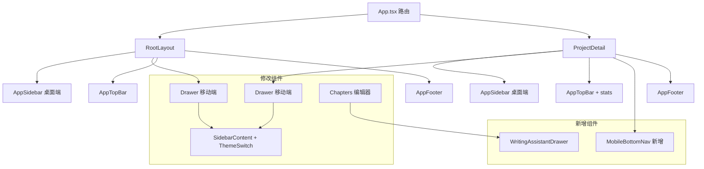

## 用户需求

对 Novel-Assistant 前端进行全面移动端适配升级，范围包括：深度优化现有适配、修复严重问题页面、新增移动端专属导航交互。

## 产品概述

一个小说创作助手平台，桌面端采用"固定侧边栏 + 内容区"布局，移动端需要从"勉强可用"升级为"原生 App 级别体验"。

## 核心功能

### 1. 写作助手面板移动端可用

- 将 WritingAssistantPanel 在移动端改为底部 Drawer 抽屉滑出
- 编辑器工具栏中恢复"写作助手"切换按钮
- 保持与桌面端相同的能力

### 2. 移动端底部导航栏

- 项目内页面新增底部 Tab 导航栏（大纲、角色、章节、更多）
- 支持当前路由高亮，替代纯 Drawer 导航
- 全局页面新增底部快捷入口

### 3. 项目统计信息移动端可见

- ProjectDetail 顶栏显示紧凑统计（大纲数、角色数、章节数、字数）
- 与 RootLayout 书架统计风格统一

### 4. 移动端 Drawer 主题切换

- Drawer 底部恢复主题切换按钮（ThemeSwitch + 系统模式）
- 保持与桌面端侧边栏一致的交互

### 5. 编辑器 Modal 移动端优化

- 配置区使用折叠面板（Collapse）减少垂直空间
- 写作风格、叙事角度、Skill 等字段分组折叠

### 6. 大纲/场景描述可展开

- 场景和情节要点在移动端支持点击展开查看完整内容
- 使用 Popover 或就地展开方式

### 7. isMobile 检测方式统一

- Outline.tsx 改用 useIsMobile() hook
- 所有页面统一使用同一 hook

### 8. Drawer 宽度响应式

- 平板设备（768px-1024px）Drawer 宽度调整为 320px
- 手机设备保持 280px

### 9. 溢出组件修复

- Settings 预设列表操作按钮在小屏换行
- Chapters 批量生成 Radio.Button 自适应
- 骨架屏移动端宽度适配

## 技术方案

### 技术栈

- 前端框架：React 18 + TypeScript 5.9
- UI 组件库：Ant Design 5.27（antd）
- 状态管理：Zustand 5
- 路由：react-router-dom 6
- CSS 方案：内联 style + 全局 CSS（沿用现有方案，不引入新依赖）

### 实现策略

**总体原则**：沿用现有架构模式（内联 style + isMobile 条件判断），不引入新依赖，最小化改动范围。

#### 1. 移动端底部导航栏（核心新增组件）

- 新建 `MobileBottomNav` 组件，仅在 ProjectDetail 路由下渲染
- 使用 Ant Design `Tabs` 组件实现底部导航，`tabPosition="bottom"`
- 导航项：大纲、角色、章节、更多（弹出更多菜单）
- 通过 `location.pathname` 匹配当前路由高亮
- 在 `ProjectDetail.tsx` 的 `Content` 底部渲染，仅在 `mobile` 时显示
- 底部导航高度约 56px，需调整内容区 `paddingBottom`

#### 2. 写作助手移动端适配

- 在 Chapters.tsx 编辑器 Modal 中，将 `{!isMobile && assistantVisible && ...}` 改为：
- 移动端使用 Ant Design `Drawer`（placement="bottom"，height="60vh"）包裹 WritingAssistantPanel
- 桌面端保持原有的侧边栏面板
- 恢复移动端的"写作助手"切换按钮

#### 3. 项目统计移动端可见

- 在 ProjectDetail.tsx 中，将 `statsActions = !mobile && (...)` 改为同时提供移动端版本
- 移动端使用紧凑单行文本（风格与 RootLayout 书架统计一致）
- 格式："N大纲 · N角色 · N章 · N字"

#### 4. Drawer 主题切换恢复

- 修改 RootLayout.tsx 和 ProjectDetail.tsx 中 Drawer 的 `showCollapsedThemeButton` 从 `false` 改为 `true`
- SidebarContent 在 collapsed=false 时本身已支持主题切换，Drawer 中 collapsed 始终为 false

#### 5. 编辑器 Modal 配置区折叠

- 在 Chapters.tsx 编辑器 Modal 中，将配置区（写作风格、叙事角度、Skill、目标字数）包裹在 `Collapse` 组件内
- 移动端默认折叠，桌面端默认展开
- 减少正文编辑区之前的垂直滚动距离

#### 6. 大纲场景描述可展开

- 在 Outline.tsx 中，场景和情节要点的 `textOverflow: ellipsis` 元素添加点击展开逻辑
- 使用 Ant Design `Popover` 显示完整内容，或使用 `Typography.Paragraph` 的 `ellipsis.expandable`

#### 7. isMobile 统一

- Outline.tsx：删除自定义 `useState(window.innerWidth <= 768)` + `resize` 监听，改用 `useIsMobile()`
- 检查其他使用 `useBreakpoint` 的组件是否可统一

#### 8. Drawer 宽度响应式

- 使用 `useIsMobile(1024)` 检测平板设备
- Drawer `width` 改为 `isTablet ? 320 : 280`

#### 9. 溢出组件修复

- Settings 预设列表：`List.Item actions` 在移动端改为底部 `Space wrap`
- Chapters 批量生成：Radio.Group 改为 `optionType="button"` + `size="small"` + CSS 允许换行
- 骨架屏：Card 宽度使用百分比或 `min-width: 0`

### 架构设计



### 目录结构

```
frontend/src/
├── components/
│   ├── MobileBottomNav.tsx      # [NEW] 移动端底部导航栏。实现项目内页面的底部 Tab 导航，包含大纲、角色、章节、更多四个入口。使用 antd Tabs 组件，tabPosition="bottom"。通过 react-router-dom 的 useLocation 匹配当前路由高亮。仅在 useIsMobile 返回 true 时渲染。
│   ├── RootLayout.tsx            # [MODIFY] Drawer 中 showCollapsedThemeButton 改为 true；Drawer 宽度响应式（平板 320px）
│   ├── AppSidebar.tsx            # [MODIFY] SidebarContent 在 Drawer 模式下适配高度（移动端顶栏 56px vs 桌面端 64px）
│   ├── AppTopBar.tsx             # [MODIFY] 支持传入 compactStats（紧凑统计）props
│   └── CardStyles.tsx            # [MODIFY] 新增移动端卡片响应式断点常量
├── pages/
│   ├── ProjectDetail.tsx         # [MODIFY] 移动端 statsActions 改为紧凑单行文本；Drawer showCollapsedThemeButton=true；Drawer 宽度响应式；集成 MobileBottomNav；内容区 paddingBottom 适配底部导航
│   ├── Chapters.tsx              # [MODIFY] 写作助手面板移动端改为底部 Drawer；编辑器配置区使用 Collapse 折叠；批量生成 Radio.Button 自适应；骨架屏宽度适配
│   ├── Outline.tsx               # [MODIFY] isMobile 检测改用 useIsMobile() hook；场景/情节描述支持点击展开（Popover 或 Typography.Paragraph ellipsis.expandable）
│   ├── Settings.tsx              # [MODIFY] 预设列表操作按钮移动端换行适配；封面配置 Tab 按钮垂直堆叠
│   └── BookshelfPage.tsx         # [MODIFY] 骨架屏移动端宽度适配
├── utils/
│   └── useIsMobile.ts            # [MODIFY] 导出 MOBILE_BREAKPOINT 和 TABLET_BREAKPOINT 常量供外部使用
└── index.css                     # [MODIFY] 新增底部导航安全区域适配；新增 .mobile-bottom-nav 样式类
```

### 关键代码结构

```typescript
// MobileBottomNav.tsx - 移动端底部导航组件接口
interface MobileBottomNavProps {
  projectId: string;
}

// 导航项定义
const NAV_ITEMS = [
  { key: 'outline', icon: <FileTextOutlined />, label: '大纲', path: 'outline' },
  { key: 'characters', icon: <TeamOutlined />, label: '角色', path: 'characters' },
  { key: 'chapters', icon: <BookOutlined />, label: '章节', path: 'chapters' },
  { key: 'more', icon: <EllipsisOutlined />, label: '更多', path: '' }, // 弹出菜单
];
```

### 实现注意事项

**性能**：

- MobileBottomNav 使用 React.memo 避免不必要的重渲染
- useIsMobile 已有 150ms 防抖，无需额外优化
- Collapse 折叠面板仅在移动端渲染，桌面端直接展开

**兼容性**：

- 所有改动均通过 isMobile 条件分支，桌面端行为不变
- Drawer 宽度改动通过新增 isTablet 变量，不影响现有手机端 280px 行为
- 底部导航在非移动端不渲染，零开销

**安全区域**：

- 底部导航需适配 iPhone X+ safe-area-inset-bottom
- 在 index.css 中新增 `.mobile-bottom-nav` 的 padding-bottom: env(safe-area-inset-bottom)

## Agent Extensions

### SubAgent

- **code-explorer**
- 用途：在实现阶段探索 Chapters.tsx、Outline.tsx 等大文件中写作助手、配置区、场景描述的具体代码位置
- 预期结果：精确定位需要修改的代码行号和上下文，确保修改准确不遗漏

### MCP

- **Playwright MCP Server**
- 用途：在移动端适配完成后，使用移动端视口（iPhone 12/13、iPad）对关键页面进行截图验证
- 预期结果：通过 playwright_resize 切换到移动端视口，对 Chapters 编辑器、Outline 场景展开、底部导航等关键交互进行截图，验证适配效果